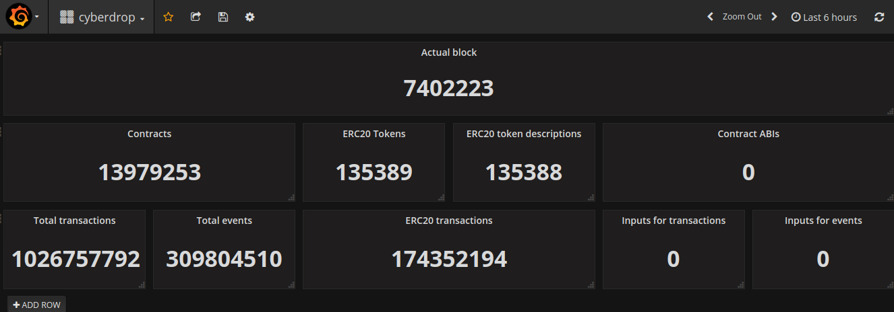
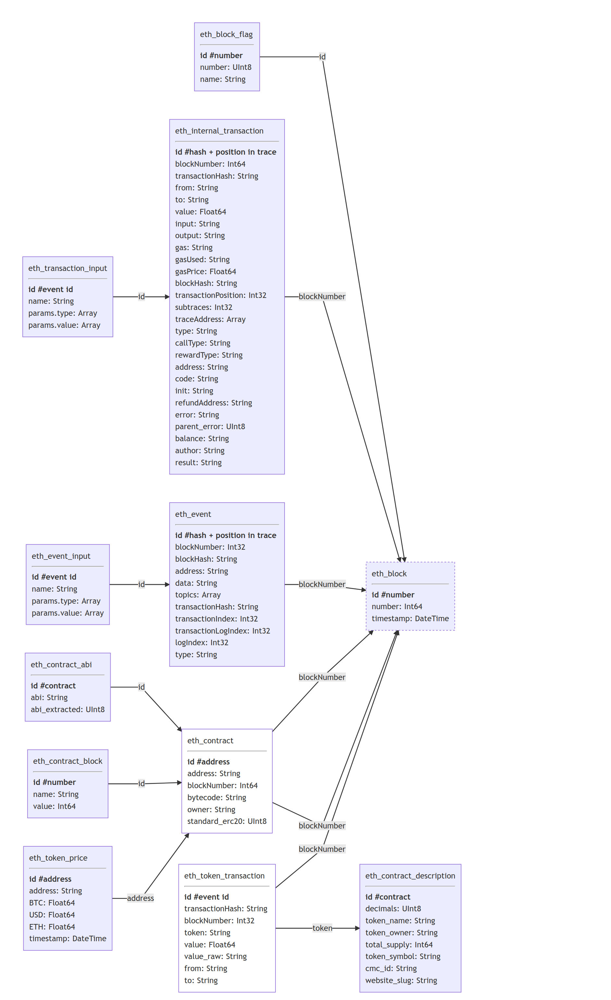

# cyber•Drop core

### Installation

To build all nessesary containers (clickhouse, parity, tabix, core), use command:
```bash
docker-compose up
```

Maybe, you'll have to wait a bit while parity will get an actual info from Ethereum chain


### Real-time synchronization

To start real-time synchronization loop, use:
```bash
docker-compose run core start
```

To start synchronization with additional info for contracts whitelisted in config.py (extract ABI, parse inputs), use:
```bash
docker-compose run core start-full
```

### Database state

Docker bundle contains grafana with dashboard. You can look at the state of database [here](http://localhost:3000/dashboard/db/cyberdrop).



**Username**: admin

**Password**: admin

Make sure you have 8123 and 3000 ports enabled

### Examples

Usage examples of the crawlers are located in [**examples**](https://gitlab.com/cyberdrop/core/blob/docker_compose/examples) dir of this repo. The actual list of examples goes below:
- [SQL queries](https://gitlab.com/cyberdrop/core/blob/docker_compose/examples/sql_balances)
- [API](https://gitlab.com/cyberdrop/core/blob/docker_compose/examples/gas_price_estimation)
- [Jupyter Notebook : gas price estimator](https://gitlab.com/cyberdrop/core/blob/docker_compose/examples/balances_api)

### Bug reports

Feel free to create an issue for the project, if you have a problem with installation. 
Please provide us the following info:
- Your docker and docker-compose versions
- The list of your modifications in containers
- Actual state of the database from tabix
- The log for unit tests:
```bash
docker-compose run core test
```

## Advanced usage

### Installation with vanilla docker

To build docker container, use command

```bash
docker build -t cyberdrop/core .
```

To install parity, use:

```bash
docker pull parity/parity:stable
docker run -p 8545:8545 parity/parity --jsonrpc-interface=all --tracing=on
```

To install clickhouse, use:

```bash
docker pull yandex/clickhouse-server:18.12.17
docker run yandex/clickhouse-server -p 9000:9000 -p 8123:8123 
```

You can see actual options for these containers in docker-compose.yml file

Make sure you've activated clickhouse and parity ports. 

```bash
$ curl localhost:8545
Used HTTP Method is not allowed. POST or OPTIONS is required

$ curl localhost:9000
Port 9000 is for clickhouse-client program.
You must use port 8123 for HTTP.
```

Check the correctness of the installation using

```bash
docker run --network host cyberdrop/core test
```

You can run other operations the same way

### Configuration

Configuration is located in config.py file. Please check this list before installation:

```python
...

# URLs of parity APIs.
# You can specify block range for each URL to use different nodes for each request
PARITY_HOSTS = [...]

# Dictionary of table names in database.
# Meaning of each table explained in Schema
INDICES = {...}

# List of contract addresses to process in several operations.
# All other contracts will be skipped during certain operations
PROCESSED_CONTRACTS = [...]

# Size of pages received from Clickhouse
BATCH_SIZE = 1000 # recommended

# Number of chunks processed simultaneously during input parsing
INPUT_PARSING_PROCESSES = 10 # recommended

# Number of blocks processed simultaneously during events extraction
EVENTS_RANGE_SIZE = 10 # recommended

# API key for etherscan.io ABI extraction
ETHERSCAN_API_KEY = "..."

...
```

### All operations
```bash
$ docker-compose run core --help

Usage: extractor.py [OPTIONS] COMMAND [ARGS]...

  Ethereum extractor

Options:
  --help  Show this message and exit.

Commands:
  prepare-database               Prepare all indices and views in database
  start                          Run partial synchronization of the database.
  start-full                     Run full synchronization of the database
  
  prepare-contracts-view         Prepare material view with contracts
  prepare-erc-transactions-view  Prepare material view with erc20
                                 transactions
  prepare-indices                Prepare tables in database
  extract-blocks                 Extract blocks with timestamp
  extract-events                 Extract events
  extract-traces                 Extract internal transactions
  extract-tokens                 Extract ERC20 token names, symbols, 
                                 total supply and etc.
  download-contracts-abi         Extract ABI description from etherscan.io
  download-prices                Download exchange rates
  parse-events-inputs            Start input parsing for events.
  parse-transactions-inputs      Start input parsing for transactions.
  
  test                           Run tests
```

### Schema

Current data schema is going below:



### Architecture

All components of this repo and their interactions can be found below:

```
TODO Will be updated
```


